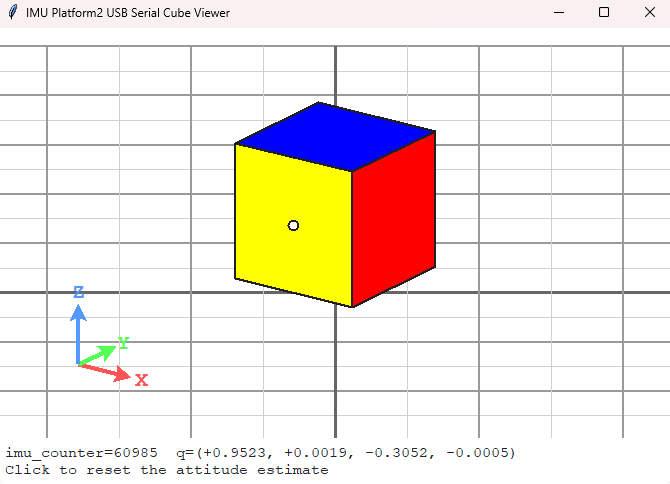
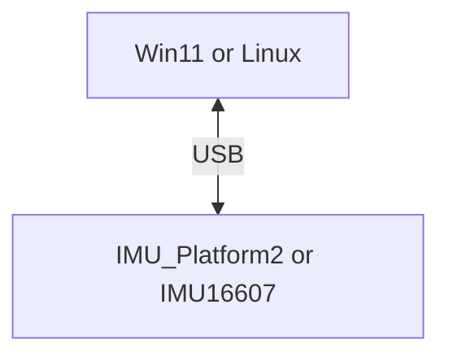
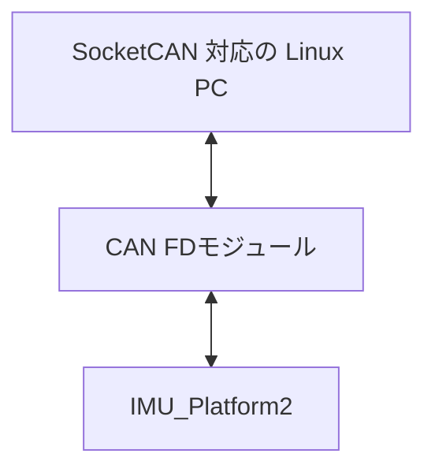

# IMU Platform2 Python テストアプリ

このリポジトリには、`IMU Platform2` の通信用 Python ツールが入っています。

- `CAN FD` での確認用
- `USB virtual COM` での確認用
- 四元数の 3D 表示ビューア

USB 仮想 COM を `ttyACM0` や `COMx` として開くシリアル実装を含みます。

## 画面イメージ



---

## 対応スクリプト

- `imu_platform2_canfd_test.py`
  - CAN FD の受信確認用
- `imu_platform2_canfd_cube_viewer.py`
  - CAN FD の 3D ビューア
- `imu_platform2_usbserial_test.py`
  - USB serial の受信確認用
- `imu_platform2_usbserial_cube_viewer.py`
  - USB serial の 3D ビューア

## 前提環境

### 共通

- Python 3.10 以降を推奨

### Windows 11

- `USB serial` 版はそのまま実行可能
- `CAN FD` 版は `SocketCAN` 前提のため、そのままでは実行不可

### Jetson Orin Nano / Linux

- `USB serial` 版と `CAN FD` 版の両方を実行可能
- `CAN FD` 版は Linux の `SocketCAN` が必要

## 必要なハードウェア

### USB serial で動作させる場合
- `IMU_Platform2` もしくは、`IMU16607`
- 対応 IMU の評価ボード(`IMU16607`では不要)
- `USB Type-C` ケーブル（付属品）
- 上位 PC（`Windows 11` または Linux）



### CAN FD で動作させる場合
- `IMU_Platform2` （設定で `CAN FD` をオンにしておく）
- 対応 IMU の評価ボード
- `SocketCAN` 対応の Linux PC（Jetson Orin Nano など）
- CAN FD モジュール: [スイッチサイエンス TCAN3413搭載 CANFDトランシーバーモジュール（3.3V対応）](https://www.switch-science.com/products/11004)
- CAN FD の通信ケーブル **自作する必要あり**



## 必要ライブラリ

### pip で入れるもの

```bash
pip install python-can pyserial
```

- `python-can`
  - CAN FD 版で使用
- `pyserial`
  - USB serial 版で使用
- `tkinter`
  - 3D ビューアで使用
  - `pip install` では追加しません
  - Windows 11 では公式 Python に通常同梱されています
  - Ubuntu / Jetson Linux では `sudo apt install python3-tk` で追加します

## 通信仕様

### CAN FD

- Linux `SocketCAN` を使用
- デフォルトチャネル: `can0`

### USB serial

- 通信条件: `921600 bps`, `8N1`
- ボーレートはコード内で `921600` 固定
- `USB` は仮想 COM として見える
- `UART` と `USB` は同じプロトコルを使用

ポート指定例:

- Windows 11 USB serial: `COM3`
- Jetson USB virtual COM: `/dev/ttyACM0`

## 実行方法

### 1. CAN FD の受信確認

```bash
python imu_platform2_canfd_test.py
```

CAN FD 版は起動時に自動で `ip link` 設定を行います。

```bash
python imu_platform2_canfd_test.py
```

### 2. CAN FD の 3D ビューア

```bash
python imu_platform2_canfd_cube_viewer.py
```

ビューアは通常ユーザーで起動してください。必要な `ip link` 設定だけが内部で `sudo` 実行されます。

```bash
python imu_platform2_canfd_cube_viewer.py
```

`sudo python ...` で起動すると、`tkinter` が X11 / Display に接続できず失敗することがあります。

### 3. USB serial の受信確認

#### Windows 11

```bash
python imu_platform2_usbserial_test.py --port COM3
```

#### Jetson USB virtual COM

```bash
python imu_platform2_usbserial_test.py --port /dev/ttyACM0
```

### 4. USB serial の 3D ビューア

#### Windows 11

```bash
python imu_platform2_usbserial_cube_viewer.py --port COM3
```

#### Jetson USB virtual COM

```bash
python imu_platform2_usbserial_cube_viewer.py --port /dev/ttyACM0
```

## よく使うオプション

### CAN FD 版

- `--channel can0`
  - 使用する SocketCAN チャネル。省略時は `can0`
- `--no-setup-link`
  - 自動の `ip link` 設定を行わず、既存の CAN 設定をそのまま使う
- `--response-timeout 3.0`
  - 応答待ちタイムアウト
- `--response-retries 5`
  - タイムアウト時の再送回数

### USB serial 版

- `--port COM3`
  - 使用する COM / TTY
- `--response-timeout 3.0`
  - 応答待ちタイムアウト
- `--response-retries 5`
  - タイムアウト時の再送回数

### 3D ビューア共通

- `--width 960`
- `--height 720`
- `--fps 60`

## 動作メモ

- CAN FD を使用する場合、`imu_platform2` の設定で `CAN FD` をオンにしておく必要があります
- 画面クリックで `CMD_RESET_FILTER` を送信します
- 下部に `imu_counter` と四元数を表示します
- CAN FD 版は Jetson Orin Nano / Linux の環境のみで動作確認済みです
- Windows環境ではwindows11 のみ動作確認済みです